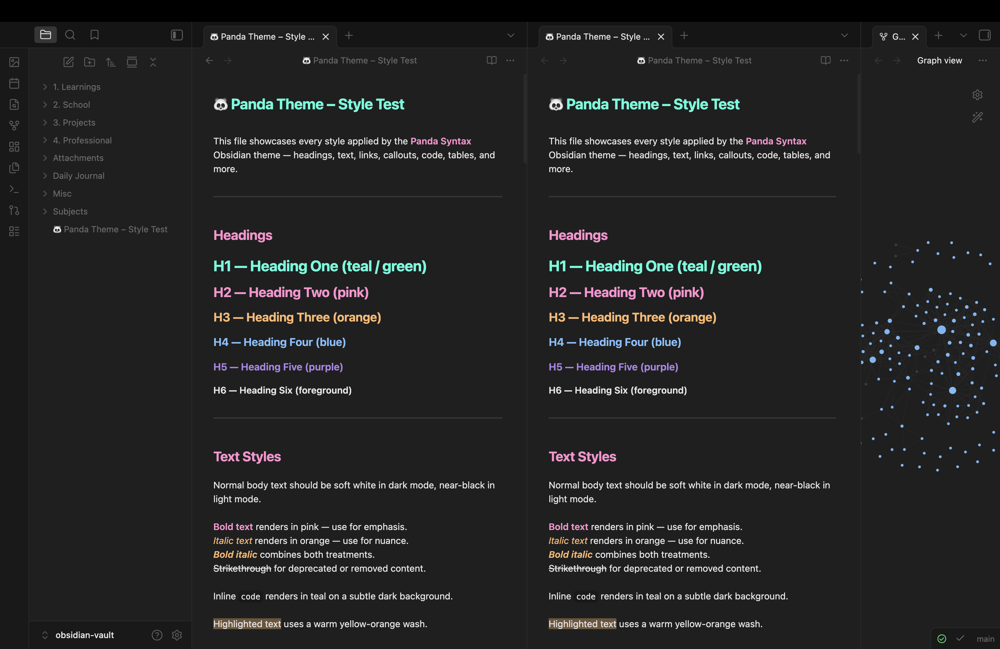
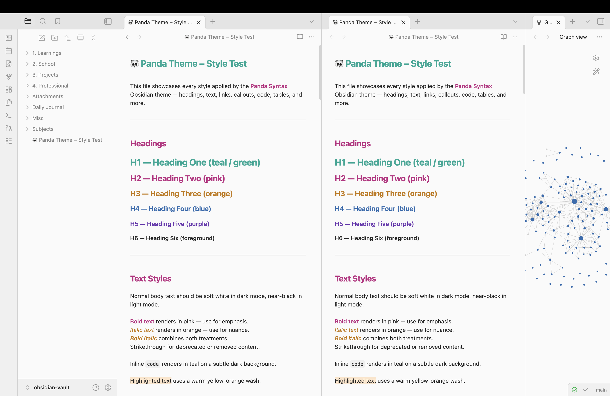

# 🐼 Panda Syntax for Obsidian

An Obsidian theme based on [Panda Syntax](https://github.com/PandaTheme/panda-syntax-vscode) by Siamak Mokhtari — a dark theme built around a soft pink, teal, and blue palette. Includes a light variant.

## Features

- Dark and light modes
- Full heading hierarchy in the Panda color palette (cyan → pink → orange → blue → purple)
- Syntax highlighting for code blocks and inline code
- Styled callouts, tables, tags, blockquotes, and highlights
- Subtle pink-tinted file explorer hover states
- Thin custom scrollbars

## Installation

Search for **Panda Syntax** in Obsidian's community theme browser (Settings → Appearance → Themes).

## Credits

Based on [Panda Syntax](https://github.com/PandaTheme/panda-syntax-vscode) by Siamak Mokhtari.
